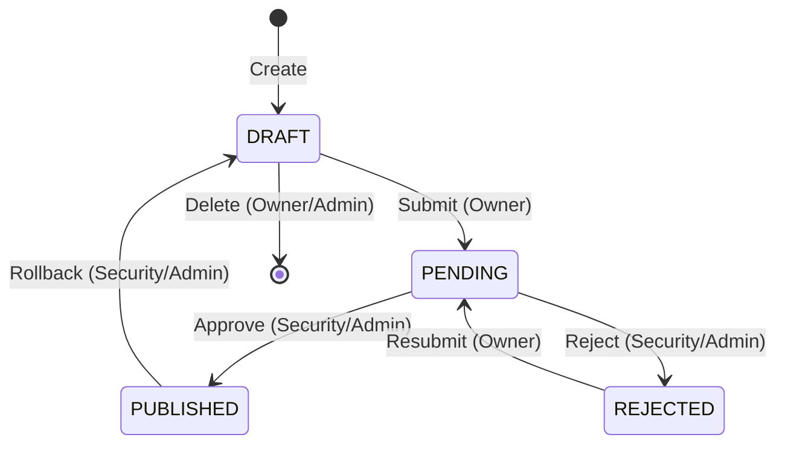

# Story 10.7: Quick Start Guide

Status: draft

## Story

As a **new user** (Developer, Security, Admin),
I want a Quick Start Guide explaining system capabilities and workflows,
so that I can quickly understand how to use API Gateway without asking colleagues.

## Feature Context

**Source:** SM Chat Session (2026-02-22) — обсуждение необходимости пользовательской документации

**Business Value:**
- Ускорение onboarding новых пользователей
- Снижение нагрузки на support/команду
- Документирование нетривиального approval workflow
- Self-service для пользователей

**Текущее состояние:**
- Техническая документация существует (README.md, CLAUDE.md, architecture.md)
- Swagger UI доступен для API exploration
- Отсутствует user-facing руководство по работе с системой

**Scope:** Минимальный viable docs — Quick Start Guide (1-2 страницы) + Workflow диаграмма

## Acceptance Criteria

### AC1: Quick Start Guide создан
**Given** новый пользователь открывает документацию
**When** он читает Quick Start Guide
**Then** он понимает:
- Как создать маршрут
- Как отправить на согласование
- Какие статусы существуют и что они значат
- Кто может approve/reject/rollback

### AC2: Workflow диаграмма включена
**Given** Quick Start Guide
**When** пользователь смотрит на workflow
**Then** он видит визуальную диаграмму:
```
DRAFT → PENDING → PUBLISHED
          ↓
       REJECTED → PENDING (resubmit)

PUBLISHED → DRAFT (rollback by Security/Admin)
DRAFT → [Delete] (by owner or Admin)
```

### AC3: Role-based permissions описаны
**Given** Quick Start Guide
**When** пользователь ищет информацию о ролях
**Then** он находит таблицу permissions:

| Операция | Developer | Security | Admin |
|----------|-----------|----------|-------|
| Create route | ✅ Свои | — | — |
| Edit DRAFT | ✅ Свои | ✅ Любые | ✅ Любые |
| Delete DRAFT | ✅ Свои | ✅ Любые | ✅ Любые |
| Submit for approval | ✅ Свои | — | — |
| Approve/Reject | — | ✅ | ✅ |
| Rollback | — | ✅ | ✅ |

### AC4: Guide доступен из UI
**Given** пользователь залогинен в систему
**When** он ищет помощь
**Then** ссылка на Quick Start Guide доступна (footer или Help menu)

## Analysis Summary

### Формат документа

**Рекомендация:** Markdown файл в `/docs/quick-start-guide.md`

**Почему не встроенная help в UI:**
- Быстрее реализовать
- Легче поддерживать
- Можно расширять без релиза frontend

### Структура Quick Start Guide

```markdown
# API Gateway — Краткое руководство

## Введение
Краткое описание что такое API Gateway и для чего он нужен.

## Роли пользователей
- Developer — создаёт и управляет своими маршрутами
- Security — согласует маршруты, может откатывать
- Admin — полный доступ + управление пользователями

## Создание маршрута
1. Перейти в Routes → Create Route
2. Заполнить поля: Path, Upstream URL, Methods
3. Сохранить (статус DRAFT)

## Workflow согласования
[Диаграмма]

## Таблица permissions
[Таблица из AC3]

## FAQ
- Как откатить опубликованный маршрут?
- Как удалить маршрут?
- Почему я не могу редактировать маршрут?
```

### Интеграция в UI

**Вариант 1 (рекомендуемый):** Ссылка в Footer
```typescript
// AppLayout footer
<Link to="/docs/quick-start-guide.md" target="_blank">
  📖 Руководство
</Link>
```

**Вариант 2:** Help иконка в Header (более сложно)

## Tasks / Subtasks

- [ ] Task 1: Создать Quick Start Guide (AC: #1, #2, #3)
  - [ ] 1.1 Создать `/docs/quick-start-guide.md`
  - [ ] 1.2 Написать секцию "Введение"
  - [ ] 1.3 Написать секцию "Роли пользователей"
  - [ ] 1.4 Написать секцию "Создание маршрута" (step-by-step)
  - [ ] 1.5 Добавить Mermaid диаграмму workflow
  - [ ] 1.6 Добавить таблицу permissions
  - [ ] 1.7 Написать FAQ (5 вопросов)

- [ ] Task 2: Добавить ссылку в UI (AC: #4)
  - [ ] 2.1 Добавить ссылку "📖 Руководство" в Footer компонент
  - [ ] 2.2 Ссылка открывается в новой вкладке

- [ ] Task 3: Review и validation
  - [ ] 3.1 Проверить что все workflow шаги корректны
  - [ ] 3.2 Проверить что permissions таблица актуальна
  - [ ] 3.3 Получить feedback от Yury

## API Dependencies Checklist

**Backend API endpoints, используемые в этой story:**

Нет — это документация, не требует backend изменений.

## Dev Notes

### Content Guidelines

1. **Язык:** Русский (согласно CLAUDE.md)
2. **Тон:** Краткий, по делу, без воды
3. **Формат:** Markdown с Mermaid диаграммами
4. **Скриншоты:** Опционально (увеличивают maintenance cost)

### Mermaid Workflow Diagram



### Файловая структура

```
docs/
├── architecture.md        # Существует
├── quick-start-guide.md   # НОВЫЙ
└── ...
```

### References

- [Source: Epic 10 Stories] — текущий функционал
- [Source: CLAUDE.md] — конвенции проекта
- [Source: backend/.../model/Route.kt] — RouteStatus enum
- [Source: backend/.../service/ApprovalService.kt] — workflow logic

## Change Log

- **2026-02-22:** Story created from SM chat session
