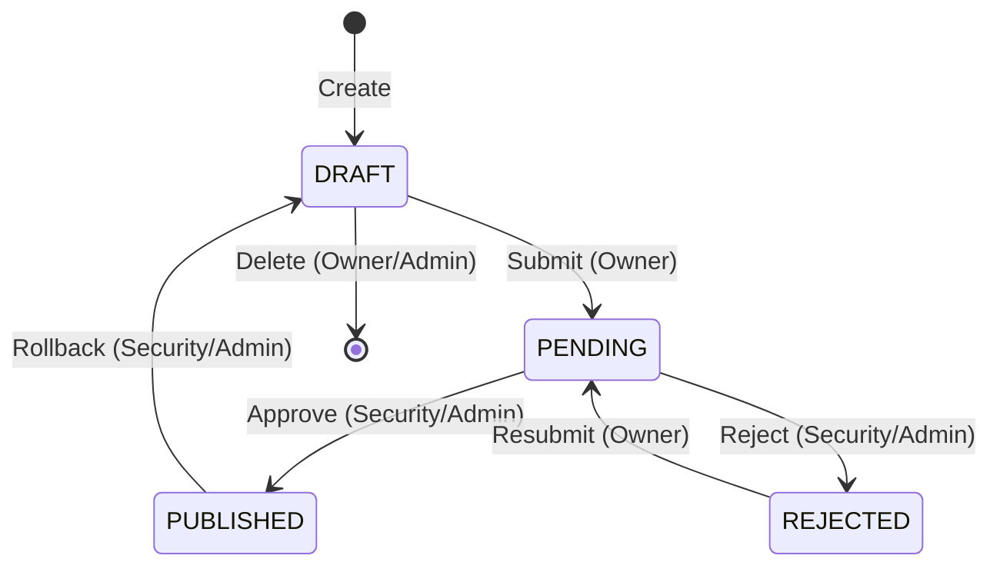

# Story 10.7: Quick Start Guide

Status: done

## Story

As a **new user** (Developer, Security, Admin),
I want a Quick Start Guide explaining system capabilities and workflows,
so that I can quickly understand how to use API Gateway without asking colleagues.

## Feature Context

**Source:** SM Chat Session (2026-02-22) — обсуждение необходимости пользовательской документации

**Business Value:**
- Ускорение onboarding новых пользователей
- Снижение нагрузки на support/команду
- Документирование нетривиального approval workflow
- Self-service для пользователей

**Scope:** Минимальный viable docs — Quick Start Guide (1-2 страницы) + Workflow диаграмма + ссылка в UI

## Acceptance Criteria

### AC1: Quick Start Guide создан
**Given** новый пользователь открывает документацию
**When** он читает Quick Start Guide
**Then** он понимает:
- Как создать маршрут
- Как отправить на согласование
- Какие статусы существуют и что они значат
- Кто может approve/reject/rollback

### AC2: Workflow диаграмма включена
**Given** Quick Start Guide
**When** пользователь смотрит на workflow
**Then** он видит визуальную диаграмму:
```
DRAFT → PENDING → PUBLISHED
          ↓
       REJECTED → PENDING (resubmit)

PUBLISHED → DRAFT (rollback by Security/Admin)
DRAFT → [Delete] (by owner or Admin)
```

### AC3: Role-based permissions описаны
**Given** Quick Start Guide
**When** пользователь ищет информацию о ролях
**Then** он находит таблицу permissions:

| Операция | Developer | Security | Admin |
|----------|-----------|----------|-------|
| Create route | Свои | — | — |
| Edit DRAFT | Свои | Любые | Любые |
| Delete DRAFT | Свои | Любые | Любые |
| Submit for approval | Свои | — | — |
| Approve/Reject | — | Да | Да |
| Rollback | — | Да | Да |

### AC4: Guide доступен из UI
**Given** пользователь залогинен в систему
**When** он ищет помощь
**Then** ссылка на Quick Start Guide доступна в Sidebar footer

## Tasks / Subtasks

- [x] Task 1: Создать Quick Start Guide (AC: #1, #2, #3)
  - [x] 1.1 Создать `/docs/quick-start-guide.md`
  - [x] 1.2 Написать секцию "Введение" (что такое API Gateway)
  - [x] 1.3 Написать секцию "Роли пользователей" (Developer, Security, Admin)
  - [x] 1.4 Написать секцию "Создание маршрута" (step-by-step с полями)
  - [x] 1.5 Добавить Mermaid диаграмму workflow (stateDiagram-v2)
  - [x] 1.6 Добавить таблицу permissions из AC3
  - [x] 1.7 Написать FAQ (5-7 частых вопросов)

- [x] Task 2: Добавить ссылку в Sidebar (AC: #4)
  - [x] 2.1 Модифицировать `Sidebar.tsx` — добавить ссылку в footer area (строки 207-226)
  - [x] 2.2 Использовать `BookOutlined` или `QuestionCircleOutlined` иконку
  - [x] 2.3 Ссылка открывается в новой вкладке (`target="_blank"`)
  - [x] 2.4 Добавить data-testid для тестирования

- [x] Task 3: Настроить Nginx для статических docs (AC: #4)
  - [x] 3.1 Добавить location `/docs/` в nginx.conf
  - [x] 3.2 Проверить доступность по URL

- [x] Task 4: Тесты
  - [x] 4.1 Тест Sidebar: `отображает ссылку на Quick Start Guide`
  - [x] 4.2 Тест Sidebar: `ссылка открывается в новой вкладке`

- [x] Task 5: Manual verification
  - [x] 5.1 Проверить что guide доступен по URL — ✅ http://localhost/docs/quick-start-guide.html (Content-Type: text/html)
  - [x] 5.2 Проверить что ссылка в Sidebar работает — ✅ Тесты проходят (24 tests)
  - [x] 5.3 Проверить workflow диаграмма отображается — ✅ ASCII-art диаграмма в HTML

## API Dependencies Checklist

**Backend изменения не требуются** — это документация + frontend link.

**Nginx изменения:**

| Location | Назначение | Статус |
|----------|-----------|--------|
| `/docs/` | Static markdown files | Требуется добавить |

## Dev Notes

### Структура Quick Start Guide

```markdown
# API Gateway — Краткое руководство

## Введение
Краткое описание что такое API Gateway и для чего он нужен.

## Роли пользователей
- Developer — создаёт и управляет своими маршрутами
- Security — согласует маршруты, может откатывать
- Admin — полный доступ + управление пользователями

## Создание маршрута
1. Перейти в Routes → Create Route
2. Заполнить поля: Path, Upstream URL, Methods
3. Сохранить (статус DRAFT)

## Workflow согласования
[Mermaid диаграмма]

## Таблица permissions
[Таблица из AC3]

## FAQ
- Как откатить опубликованный маршрут?
- Как удалить маршрут?
- Почему я не могу редактировать маршрут?
```

### Mermaid Workflow Diagram



> **Примечание:** В HTML версии (`quick-start-guide.html`) используется ASCII-art диаграмма вместо Mermaid,
> поскольку Mermaid требует подключения JavaScript библиотеки. Для standalone HTML документа ASCII-art
> обеспечивает визуализацию без внешних зависимостей.

### Sidebar Integration

**Файл:** `frontend/admin-ui/src/layouts/Sidebar.tsx`

**Текущая структура footer (строки 207-226):**
```typescript
// Footer с collapse button
<div style={{ ... }}>
  <Button ... onClick={toggleCollapsed}>
    {collapsed ? <MenuUnfoldOutlined /> : <MenuFoldOutlined />}
  </Button>
</div>
```

**Рекомендуемое изменение:**
```typescript
import { BookOutlined } from '@ant-design/icons'

// Footer с Guide link + collapse button
<div style={{ padding: '16px', borderTop: '1px solid #f0f0f0', display: 'flex', justifyContent: 'space-between' }}>
  <Button
    type="text"
    icon={<BookOutlined />}
    href="/docs/quick-start-guide.md"
    target="_blank"
    data-testid="quick-start-guide-link"
  >
    {!collapsed && 'Руководство'}
  </Button>
  <Button ... onClick={toggleCollapsed}>
    ...
  </Button>
</div>
```

### Nginx Configuration

**Файл:** `nginx/nginx.conf` или `docker-compose.yml` volume mount

**Добавить location:**
```nginx
location /docs/ {
    alias /app/docs/;
    default_type text/plain;
    charset utf-8;
}
```

**Или volume mount в docker-compose.yml:**
```yaml
nginx:
  volumes:
    - ./docs:/app/docs:ro
```

### Паттерн из Story 10.6 (ApiDocsLinks)

Использовать аналогичный подход:
- Ant Design Button с иконкой
- `target="_blank"` + `rel="noopener noreferrer"`
- `data-testid` для тестов
- Тесты на русском языке

### Файловая структура

```
docs/
├── quick-start-guide.md   # НОВЫЙ
└── .gitkeep

frontend/admin-ui/src/layouts/
├── Sidebar.tsx            # МОДИФИЦИРОВАТЬ
└── Sidebar.test.tsx       # МОДИФИЦИРОВАТЬ (добавить тесты)

nginx/
└── nginx.conf             # МОДИФИЦИРОВАТЬ (location /docs/)
```

### References

- [Source: Story 10.6] — паттерн ApiDocsLinks для ссылок
- [Source: CLAUDE.md] — конвенции проекта (русский язык)
- [Source: Sidebar.tsx:207-226] — текущий footer layout
- [Source: backend/.../model/Route.kt] — RouteStatus enum для диаграммы
- [Source: backend/.../service/ApprovalService.kt] — workflow logic

## Dev Agent Record

### Agent Model Used

Claude Opus 4.5 (claude-opus-4-5-20251101)

### Debug Log References

Нет ошибок.

### Completion Notes List

- ✅ Создан Quick Start Guide в двух форматах: markdown и HTML с CSS стилями (dark mode support)
- ✅ Добавлена ссылка в Sidebar footer с иконкой BookOutlined
- ✅ Настроен Nginx location `/docs/` для отдачи статических файлов
- ✅ Добавлен volume mount в docker-compose.override.yml
- ✅ Написаны 5 unit тестов для проверки ссылки
- ✅ Все 531 frontend тестов проходят
- ✅ Manual verification: guide доступен по http://localhost/docs/quick-start-guide.html

### File List

- `docs/quick-start-guide.md` — CREATED (Quick Start Guide в markdown)
- `docs/quick-start-guide.html` — CREATED (Quick Start Guide в HTML с CSS стилями)
- `frontend/admin-ui/src/layouts/Sidebar.tsx` — MODIFIED (добавлена ссылка на guide)
- `frontend/admin-ui/src/layouts/Sidebar.test.tsx` — MODIFIED (добавлены тесты для ссылки)
- `docker/nginx/nginx.conf` — MODIFIED (добавлен location /docs/)
- `docker-compose.override.yml.example` — MODIFIED (добавлен volume ./docs:/app/docs:ro)

## Change Log

- **2026-02-22:** Story created from SM chat session
- **2026-02-22:** Full analysis completed, status → ready-for-dev
- **2026-02-22:** Implementation completed — Quick Start Guide (MD + HTML), Sidebar link, Nginx config, tests passed, status → review
- **2026-02-22:** Code review fixes — исправлен File List (docker-compose.override.yml.example), добавлен aria-label для accessibility, добавлены тесты для developer/security ролей
