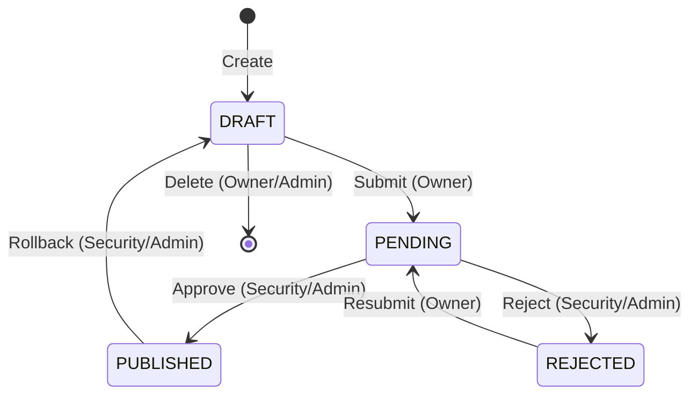

# API Gateway — Краткое руководство

Добро пожаловать в API Gateway! Это руководство поможет вам быстро начать работу с системой.

## Введение

**API Gateway** — это централизованная точка входа для всех API-запросов. Система обеспечивает:

- **Маршрутизацию** — направление запросов к нужным сервисам
- **Rate Limiting** — защиту сервисов от перегрузки
- **Контроль доступа** — approval workflow для всех изменений
- **Мониторинг** — метрики и аудит всех операций

## Роли пользователей

В системе существуют три роли с разными полномочиями:

| Роль | Описание |
|------|----------|
| **Developer** | Создаёт и управляет своими маршрутами, отправляет на согласование |
| **Security** | Согласует маршруты (approve/reject), может откатывать опубликованные |
| **Admin** | Полный доступ: управление пользователями, rate limits, все операции |

## Создание маршрута (для Developer)

### Шаг 1: Перейти в Routes

1. Откройте боковое меню
2. Нажмите **Routes**

### Шаг 2: Создать новый маршрут

1. Нажмите кнопку **Create Route**
2. Заполните обязательные поля:

| Поле | Описание | Пример |
|------|----------|--------|
| **Path** | URL путь для маршрутизации | `/api/users` |
| **Upstream URL** | URL целевого сервиса | `http://users-service:8080` |
| **Methods** | Разрешённые HTTP методы | GET, POST |
| **Description** | Описание маршрута (опционально) | Сервис пользователей |

3. Нажмите **Save**

После сохранения маршрут появится со статусом **DRAFT**.

### Шаг 3: Отправить на согласование

1. Найдите созданный маршрут в списке
2. Нажмите на него для открытия деталей
3. Нажмите **Submit for Approval**

Статус изменится на **PENDING** — теперь маршрут ожидает проверки Security.

## Workflow согласования

Диаграмма показывает жизненный цикл маршрута:

### Описание статусов

| Статус | Значение | Что делать |
|--------|----------|------------|
| **DRAFT** | Черновик, можно редактировать | Отправить на согласование |
| **PENDING** | Ожидает проверки Security | Дождаться решения |
| **PUBLISHED** | Одобрен и активен в Gateway | Маршрут работает |
| **REJECTED** | Отклонён, требует доработки | Исправить и переотправить |

## Таблица permissions

Что может делать каждая роль:

| Операция | Developer | Security | Admin |
|----------|:---------:|:--------:|:-----:|
| Создать маршрут | Свои | — | — |
| Редактировать DRAFT | Свои | Любые | Любые |
| Удалить DRAFT | Свои | Любые | Любые |
| Отправить на согласование | Свои | — | — |
| Approve/Reject маршрут | — | Да | Да |
| Rollback (откат) | — | Да | Да |
| Управление пользователями | — | — | Да |
| Управление Rate Limits | — | — | Да |

## FAQ (Часто задаваемые вопросы)

### Как откатить опубликованный маршрут?

Только **Security** или **Admin** могут откатить опубликованный маршрут:
1. Откройте детали маршрута со статусом PUBLISHED
2. Нажмите **Rollback**
3. Маршрут вернётся в статус DRAFT

### Как удалить маршрут?

Удалить можно только маршрут в статусе **DRAFT**:
- **Developer** — только свои маршруты
- **Security/Admin** — любые черновики

### Почему я не могу редактировать маршрут?

Редактирование доступно только для маршрутов в статусе **DRAFT**:
- Если статус PENDING — дождитесь решения Security
- Если статус PUBLISHED — попросите Security сделать Rollback
- Если статус REJECTED — маршрут автоматически переходит в DRAFT после resubmit

### Как посмотреть историю изменений маршрута?

1. Перейдите в **Routes**
2. Откройте детали маршрута
3. Перейдите на вкладку **History**

### Как найти свои маршруты?

В разделе **Routes** используйте фильтр **Author** и выберите своё имя.

### Где посмотреть метрики маршрута?

1. Перейдите в раздел **Metrics**
2. Выберите временной период
3. Посмотрите Top Routes по количеству запросов

### Как связаться с командой поддержки?

При возникновении вопросов обратитесь к администратору системы или в Slack-канал #api-gateway-support.

---

*Последнее обновление: 2026-02-22*
